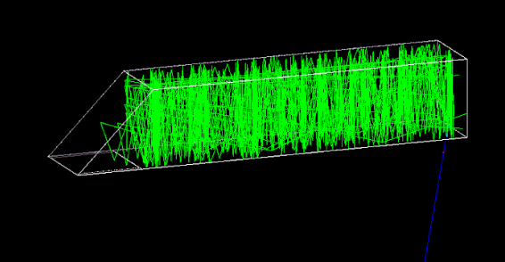
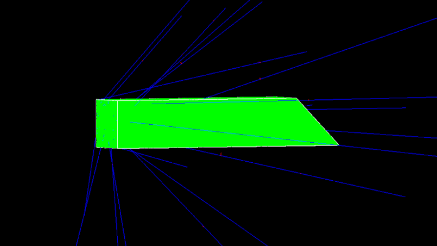
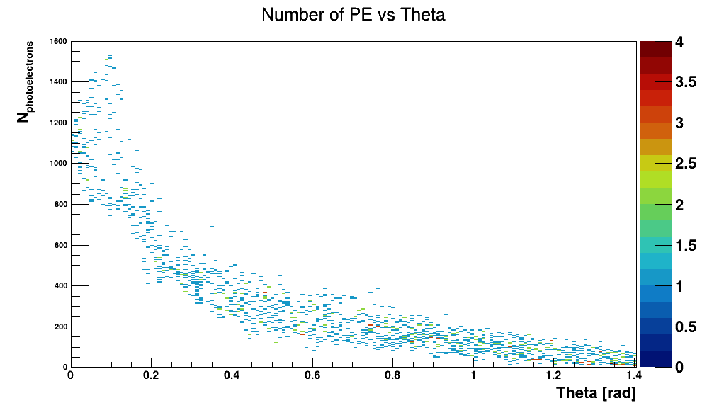

# Cherenkov Radiation – GasTOF Detector
## 1. Introduction
The goal of the project was to design a gas Cherenkov radiation detector consisting of a chamber filled with C4F10 gas, surrounded by mirrors and a photocathode. The purpose was to analyze generated photons, and through them, the incoming protons.

Protons always entered through the front face. However, to investigate various scenarios, randomized parameters were implemented: position on the front face, angle of incidence (defined by two angles: φ and θ), and energy (in the range of 0.01 - 221 GeV).

By default, the proton has 200 GeV of energy and travels centrally and parallel to the x-axis. Statistics were gathered for 2000 protons.

– Reflections from a single proton

  

– Reflections from 20 protons

  

 

## 2. Results

### 2.1 Central parallel beam, Ep = 200 GeV

– Photon impact distribution on the photocathode

  

 

– Photoelectron time distribution

  

 

– Photoelectron count distribution

  

 

– Energy distribution of incident photons

  

 

Observations:
- The center of the cone (Fig. 3) corresponds to the proton impact point.
- Photon energy range: 2.8 eV – 7.7 eV.
- Most photoelectrons are emitted around 1.5 ns.
- Approximately 1100 photoelectrons are generated on average.

### 2.2 Parallel beam with random proton position on front face, Ep = 200 GeV

– Photoelectron count vs. distance from beam axis

  

 

– Average photoelectron count vs. distance

  

 

Findings:
- The average photoelectron count is relatively constant.
- Greater distance leads to greater fluctuations.

### 2.3 Central beam with random angle of incidence, Ep = 200 GeV

– Photoelectrons vs. angle φ

  

 

– Photoelectrons vs. angle θ

  

 

– Photoelectrons vs. direction of incidence

  

 

Findings:
- The angle θ has the greatest impact – the smaller it is, the more photons are generated.
- For angle φ, generation peaks at mid-range values.

### 2.4 Central parallel beam with variable energy

– Photoelectrons vs. proton energy

  

 

– Average photoelectrons vs. proton energy

  

 

Findings:
- The number of photoelectrons increases with energy.
- Stabilization occurs above approx. 30 GeV.

---

### Table of Contents
- Introduction
- Results
  - Central parallel beam, Ep = 200 GeV
  - Random proton position, Ep = 200 GeV
  - Random angle of incidence, Ep = 200 GeV
  - Variable proton energy
